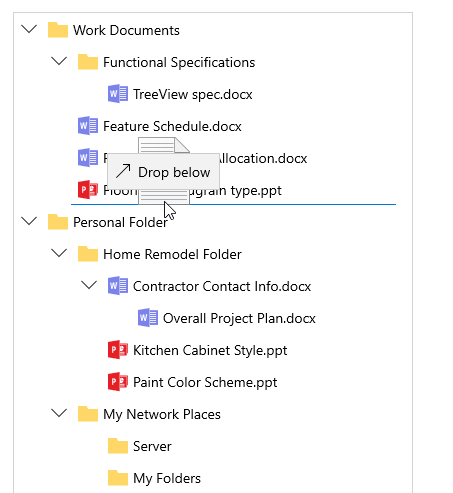
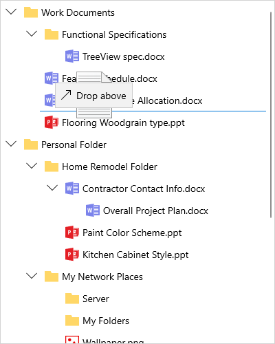

# How to drag and drop items in WinUI TreeView (SfTreeView)?

## About the sample
This example illustrates how to drag and drop items in WinUI TreeView (SfTreeView)?

[WinUI TreeView](https://www.syncfusion.com/winui-controls/treeview) (SfTreeView) allows drag and drop the items within and between controls by setting the [CanDrag](https://docs.microsoft.com/en-us/windows/winui/api/microsoft.ui.xaml.uielement.candrag?view=winui-3.0) and [AllowDrop](https://docs.microsoft.com/en-us/windows/winui/api/microsoft.ui.xaml.uielement.allowdrop?view=winui-3.0) properties to true. It is also possible to drag and drop the items between Treeview and other controls such as **ListView** and **SfDataGrid**.

```XML

<treeView:SfTreeView   x:Name="treeView"
                       Width="400"
                       Height="500"
                       CanDrag="True"
                       AllowDrop="True"
                       AutoExpandMode="AllNodes"
                       ChildPropertyName="Childs"
                       BorderBrush="LightGray"
                       IsAnimationEnabled="True"
                       BorderThickness="1"
                       FullRowSelect="True"
                       ItemsSource="{Binding Nodes1}">
            <treeView:SfTreeView.ItemTemplate>
                <DataTemplate>
                    <StackPanel Orientation="Horizontal">
                        <ContentPresenter Width="20"
                                          Height="20"
                                          HorizontalAlignment="Stretch"
                                          VerticalAlignment="Center"
                                          ContentTemplate="{Binding ImageTemplate}" />
                        <TextBlock        Margin="5"
                                          VerticalAlignment="Center"
                                          Text="{Binding Header}" />
                    </StackPanel>
                </DataTemplate>
            </treeView:SfTreeView.ItemTemplate>
</treeView:SfTreeView>

```


The dragged items can be added above or below the target item based on the drag indicator position when dropping.

For example, if an item is dropped at the bottom of the targeted item, it will be added below the targeted item.



If an item is dropped above the targeted item, it will be added above the targeted item.



## Dragging multiple items

TreeView allows to drag multiple selected items. To enable multiple selection, set the [SfTreeView.SelectionMode](https://help.syncfusion.com/cr/winui/Syncfusion.UI.Xaml.TreeView.SfTreeView.html#Syncfusion_UI_Xaml_TreeView_SfTreeView_SelectionMode) as [Multiple](https://help.syncfusion.com/cr/winui/Syncfusion.UI.Xaml.TreeView.SelectionMode.html#Syncfusion_UI_Xaml_TreeView_SelectionMode_Multiple) or [Extended](https://help.syncfusion.com/cr/winui/Syncfusion.UI.Xaml.TreeView.SelectionMode.html#Syncfusion_UI_Xaml_TreeView_SelectionMode_Extended).

```XML

<treeView:SfTreeView x:Name="treeView"
                     Width="400"
                     Height="500"
                     CanDrag="True"
                     AllowDrop="True" 
                     SelectionMode="Multiple"
                     AutoExpandMode="AllNodes"
                     ChildPropertyName="Childs"
                     BorderBrush="LightGray"
                     IsAnimationEnabled="True"
                     BorderThickness="1"
                     FullRowSelect="True"
                     ItemsSource="{Binding Nodes1}">
            <treeView:SfTreeView.ItemTemplate>
                <DataTemplate>
                    <StackPanel Orientation="Horizontal">
                        <ContentPresenter Width="20"
                                          Height="20"
                                          HorizontalAlignment="Stretch"
                                          VerticalAlignment="Center"
                                          ContentTemplate="{Binding ImageTemplate}" />
                        <TextBlock        Margin="5"
                                          VerticalAlignment="Center"
                                          Text="{Binding Header}" />
                    </StackPanel>
                </DataTemplate>
            </treeView:SfTreeView.ItemTemplate>
</treeView:SfTreeView

 ```
  
 
  
 ## Drag and drop between two TreeView’s
  
 To perform the dragging operation between two Treeview’s, customize the[ SfTreeView.ItemDragStarting](https://help.syncfusion.com/cr/winui/Syncfusion.UI.Xaml.TreeView.SfTreeView.html#Syncfusion_UI_Xaml_TreeView_SfTreeView_ItemDragStarting), [SfTreeView.ItemDropping](https://help.syncfusion.com/cr/winui/Syncfusion.UI.Xaml.TreeView.SfTreeView.html#Syncfusion_UI_Xaml_TreeView_SfTreeView_ItemDropping) and [SfTreeView.ItemDropped](https://help.syncfusion.com/cr/winui/Syncfusion.UI.Xaml.TreeView.SfTreeView.html#Syncfusion_UI_Xaml_TreeView_SfTreeView_ItemDropped) events.
  
  ```C#
  
treeView.ItemDragStarting += OnItemDragStarting;
treeView.ItemDropping += OnFirstTreeViewItemDropping;
treeView1.ItemDropping += OnItemDropping;
treeView1.ItemDropped += OnItemDropped;

private void OnItemDropped(object sender, Syncfusion.UI.Xaml.TreeView.TreeViewItemDroppedEventArgs e)
{
            var parentNode = e.TargetNode.ParentNode;
            var collection = parentNode.ChildNodes;
            var record = e.DraggingNodes[0].Content as Folder;
            int count = 0;
            foreach (var child in parentNode.ChildNodes)
            {
                var childNode = child.Content as Folder;
                if (childNode.FileName == record.FileName)
                {
                    count++;
                    if (count > 1)
                    {
                        // Remove dropped node if the parent has the same node in it
                        collection.Remove(child);
                        return;
                    }

                }
            }
}

private void OnItemDropping(object sender, Syncfusion.UI.Xaml.TreeView.TreeViewItemDroppingEventArgs e)
{
            //Restrict the dropping for drop position as above
            if (e.DropPosition == Syncfusion.UI.Xaml.TreeView.DropPosition.DropAbove)
                e.Handled = true;

            //Restrict the dropping on certain nodes
            var record = e.TargetNode.Content as Folder;
            if (record.FileName == "Documents")
                e.Handled = true;
}

private void OnItemDragStarting(object sender, Syncfusion.UI.Xaml.TreeView.TreeViewItemDragStartingEventArgs e)
{
            //Restrict the dragging for certain node
            var record = e.DraggingNodes[0].Content as Folder;
            if (record.FileName == "Downloads")
                e.Cancel = true;
}

private void OnFirstTreeViewItemDropping(object sender, Syncfusion.UI.Xaml.TreeView.TreeViewItemDroppingEventArgs e)
{
            //Restrict the dropping in first treeview
            e.Handled = true;
}

```
  

 
Take a moment to peruse the [WinUI TreeView - Drag and Drop](https://help.syncfusion.com/winui/treeview/drag-and-drop) documentation, to learn more about drag and drop with code examples.
  

